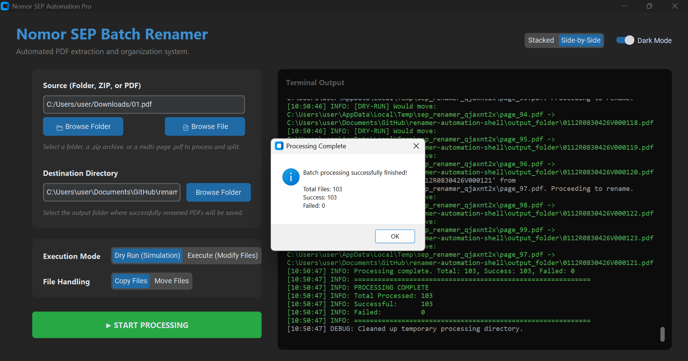

# Nomor SEP Renamer

A production-ready Python automation system that systematically processes PDF documents to extract and identify 'Nomor SEP' values from text content, then intelligently renames each PDF file using the discovered 'Nomor SEP' identifier.

The **SEP Number** is processed and extracted from data generated by the **JKN Application** from **Kementerian Kesehatan RI**. This system automates the file renaming process, ensuring all documents meet the standard claim requirements for **BPJS Kesehatan**.

## Features

- **Dual Extraction Engines:** Uses `PyPDF2` with an automatic fallback to `pdfplumber`.
- **Advanced Text Search:** Supports Case-insensitive Regular Expressions and configurable Fuzzy Matching (80-95% threshold).
- **Intelligent File Renaming:** Formats extracted strings for valid filesystem names.
- **Robust Filesystem Operations:** Handles collisions with auto-numbering (e.g., `123_1.pdf`) and atomic moves.
- **Modular Batch Processing:** Configurable concurrency (1-50 parallel threads).
- **Error Handling & Resilience:** Detailed logging (Rotating files + Colored console) and fallback mechanisms (Error directory).
- **Quality Assurance:** Covered by extensive `pytest` suites.
- **Cross-Platform:** Works on Windows, Linux, and macOS.
