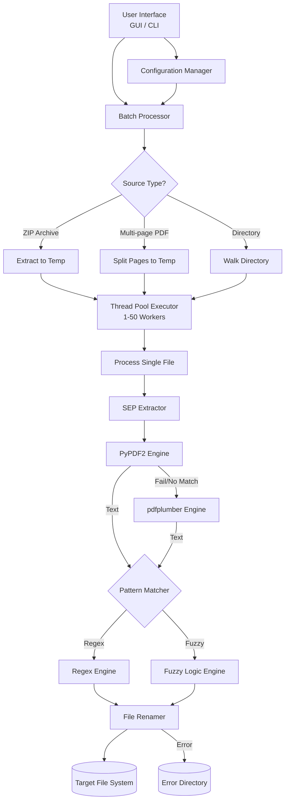

# Software Design Document (SDD)
**Project Name:** Nomor SEP Renamer Automation  
**Version:** 1.0.0  
**Date:** May 2026  

---

## 1. Project Overview
The **Nomor SEP Renamer Automation** is a production-ready system designed to systematically process PDF documents and ZIP archives. The core objective is to extract and identify specific "Nomor SEP" values from document text and intelligently rename each file using the discovered identifier. 

The system supports both a Command Line Interface (CLI) and a rich Graphical User Interface (GUI) featuring dark/light modes, multi-threading, dry-run simulations, and robust exception handling.

---

## 2. Architecture Diagrams



---

## 3. Module Specifications

### `gui_app.py` & `cli.py` (Presentation Layer)
- **Responsibility:** Captures user input, handles UI updates, provides real-time logging feedback to the user, and instantiates the `BatchProcessor`.
- **Key Components:** `CustomTkinter` App, Argument Parser, Multi-threading UI Dispatcher.

### `processor.py` (Processing Layer)
- **Responsibility:** Manages concurrency and task distribution. Pre-processes files (splitting PDFs and extracting ZIPs) using `tempfile`. 
- **Key Components:** `BatchProcessor`, `ThreadPoolExecutor`.

### `extractor.py` (Extraction Layer)
- **Responsibility:** Opens PDFs, reads text, and searches for the "Nomor SEP" target value.
- **Key Components:** `SEPExtractor`, internal sanitization functions. Falls back gracefully between lightweight (`PyPDF2`) and heavyweight (`pdfplumber`) PDF libraries.

### `renamer.py` (Persistence Layer)
- **Responsibility:** Executes I/O operations (Move or Copy). Identifies duplicate filenames and automatically appends safe suffixes (e.g., `_1`, `_2`). Handles failed files by routing them to an error directory.
- **Key Components:** `FileRenamer`, Atomic operations via `shutil` and `os`.

### `config.py` & `logger.py` (Cross-cutting Concerns)
- **Responsibility:** State management via standard YAML and tracking telemetry across threaded components using Python's thread-safe logging.

---

## 4. Interface Definitions

### 4.1 Internal API
- `SEPExtractor.extract(pdf_path: str) -> Optional[str]`: Takes an absolute file path to a PDF. Returns a sanitized SEP string if found; otherwise, `None`.
- `FileRenamer.process_file(source_path: str, sep_number: str) -> Tuple[bool, str]`: Takes the source path and extracted SEP. Performs the I/O action and returns a success boolean alongside the new target path.
- `BatchProcessor.run() -> Tuple[int, int, int]`: Executes the configured batch job. Returns `(Total Processed, Success Count, Failure Count)`.

### 4.2 Configuration YAML Schema
```yaml
directories:
  source: "./input"
  target: "./output"
  error: "./error"
processing:
  concurrency: 10
  move_on_success: true
  dry_run: false
search:
  use_regex: true
  regex_pattern: 'Nomor\s*SEP.*?([a-zA-Z0-9\-\/]*\d[a-zA-Z0-9\-\/]*)'
  use_fuzzy: true
  fuzzy_threshold: 85
  fuzzy_target: "Nomor SEP :"
```

---

## 5. Data Models

The primary data model driving the application state is the `Config` Dataclass.

| Attribute | Type | Description |
|-----------|------|-------------|
| `source_dir` | `str` | Directory, ZIP, or PDF source file. |
| `target_dir` | `str` | Destination folder for renamed PDFs. |
| `error_dir` | `str` | Destination folder for corrupted/unmatched files. |
| `concurrency` | `int` | Thread pool maximum worker count. |
| `dry_run` | `bool` | Toggles simulation mode (No I/O operations). |
| `move_on_success` | `bool` | Toggles moving files vs copying files. |
| `regex_pattern` | `str` | Primary pattern utilized for regex capture groups. |
| `fuzzy_threshold` | `int` | Levenshtein distance boundary (0-100). |

---

## 6. Security Requirements

1. **Air-gapped Safety:** The system operates 100% locally. No external APIs or telemetry servers are called, ensuring zero risk of sensitive medical/SEP data leakage.
2. **Path Traversal Prevention:** Extracted strings are aggressively sanitized to remove trailing slashes or backslashes `re.sub(r'[^a-zA-Z0-9\-]', '', sep)` to prevent directory traversal injections.
3. **Atomic Operations:** Uses `os.makedirs` with `exist_ok=True` and `shutil` high-level file operations to ensure safe cross-disk file movements.
4. **Corrupted File Sandboxing:** Any file triggering a buffer exception, decryption error, or extraction failure is isolated into a specific `/error` directory instead of crashing the environment.

---

## 7. Performance Criteria

1. **Throughput:** Capable of processing 100 single-page PDF files in under 5 minutes on standard consumer hardware.
2. **Concurrency Limitation:** Thread pool strictly limited (Max 50) to prevent CPU thrashing and out-of-memory (OOM) errors. 
3. **Fallback Efficiency:** `PyPDF2` (fast, low memory) is executed first. `pdfplumber` (slower, memory-heavy) is explicitly reserved as a fallback to preserve overall batch speed.
4. **Temporary Space Management:** Intermediate extraction folders (used for ZIP parsing and PDF splitting) are automatically pruned inside a `finally` block to prevent disk space bloat.

---
